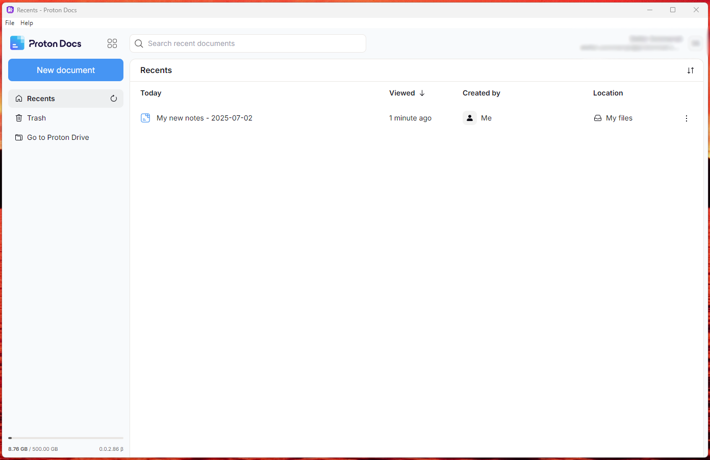

# Proton Docs Desktop

An unofficial Electron desktop app wrapper for [Proton Docs](https://docs.proton.me), perfect for note-taking and document editing with a native desktop experience.
Created by Stefan Sommarsjö.



## Features

- **Native Desktop Experience** - Dedicated window for Proton Docs
- **Clean Interface** - Removes duplicate UI elements for a streamlined experience
- **Keyboard Shortcuts** - Quick refresh and navigation
- **Cross-Platform** - Works on Windows, macOS, and Linux
- **Secure** - Uses the official Proton Docs web interface with end-to-end encryption
- **Offline-Ready** - Works offline once loaded (limited functionality)

## Installation

### Prerequisites
- [Node.js](https://nodejs.org/) (version 14 or higher)
- npm (comes with Node.js)

### Setup
1. Clone this repository:
   ```bash
   git clone https://github.com/sestsom/proton-docs-desktop.git
   cd proton-docs-desktop
   ```

2. Install dependencies:
   ```bash
   npm install
   ```

3. Run the application:
   ```bash
   npm start
   ```

## Building

To build the application for distribution:

```bash
# Build for current platform
npm run build

# Build for specific platforms
npm run build-win    # Windows
npm run build-mac    # macOS
npm run build-linux  # Linux
```

Built applications will be available in the `dist` folder.

## Usage

1. Launch the application
2. Sign in with your Proton account
3. Create and edit documents just like in the web version
4. Use keyboard shortcuts:
   - `Ctrl+R` (or `Cmd+R` on Mac) - Refresh
   - `Ctrl+Q` (or `Cmd+Q` on Mac) - Quit

## Custom Icon

To use your own app icon:
1. Create an `assets` folder in the project directory
2. Add your icon files:
   - `icon.png` (512x512 or 1024x1024)
   - `icon.ico` (for Windows)
   - `icon.icns` (for macOS)

## Development

### Project Structure
```
proton-docs-desktop/
├── main.js          # Main Electron process
├── package.json     # Project configuration
├── assets/          # Icon files (optional)
└── README.md        # This file
```

### Contributing
1. Fork the repository
2. Create a feature branch: `git checkout -b feature-name`
3. Make your changes
4. Commit: `git commit -am 'Add some feature'`
5. Push: `git push origin feature-name`
6. Submit a pull request

## Security

This application:
- Uses the official Proton Docs web interface
- Maintains all Proton's security features
- Restricts navigation to Proton domains only
- Prevents unauthorized external links

## Disclaimer

This is an **unofficial** desktop wrapper for Proton Docs. It is not affiliated with or endorsed by Proton AG. This project simply provides a desktop interface for the existing Proton Docs web service.

## License

MIT License - see [LICENSE](LICENSE) file for details.

## Support

- For Proton Docs issues: [Proton Support](https://proton.me/support)
- For app-specific issues: [Create an issue](https://github.com/sestsom/proton-docs-desktop/issues)

## Acknowledgments

- Built with [Electron](https://www.electronjs.org/)
- Uses [Proton Docs](https://docs.proton.me) web interface
- Thanks to the Proton team for creating an excellent document platform